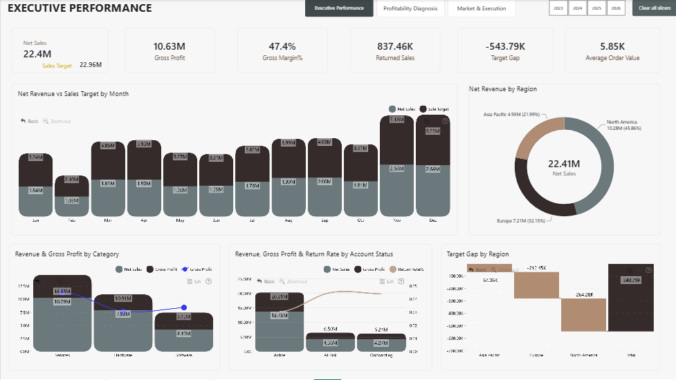
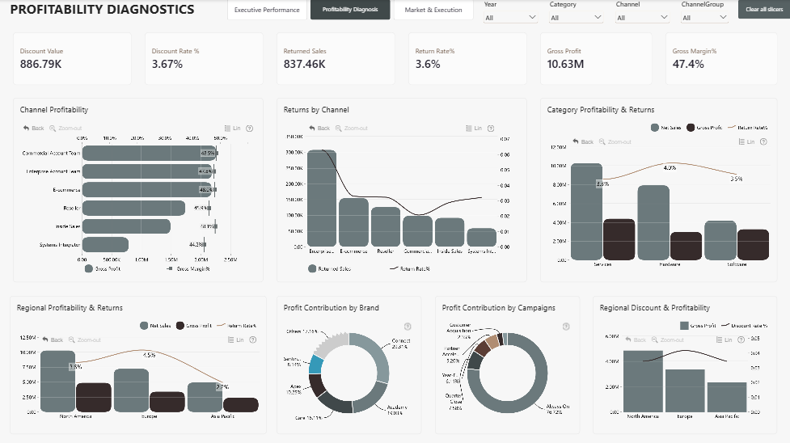
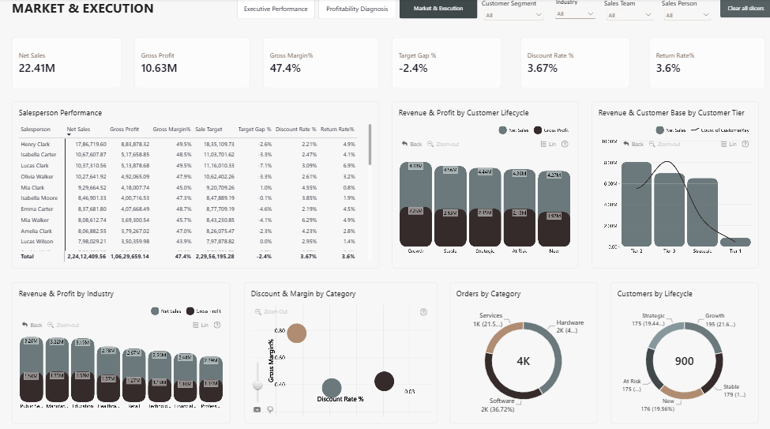

# Sales Performance & Profitability Dashboard

An interactive **Sales Performance & Profitability Dashboard** developed in Microsoft Power BI as part of the **ZoomCharts Power BI Challenge – August 2026**.

The report provides a multi-level view of business performance, combining executive KPIs with profitability diagnostics, sales execution, and customer analysis.

## 🔗 Interactive Dashboard

[View the Interactive Power BI Report](https://app.powerbi.com/view?r=eyJrIjoiOTQyZjc5NDMtMDFhMS00ZjU3LWI5ZTAtNWU3MTY3NWRlOWZhIiwidCI6IjQ2NTRiNmYxLTBlNDctNDU3OS1hOGExLTAyZmU5ZDk0M2M3YiIsImMiOjl9)

> The report was validated by ZoomCharts and accepted as a valid entry for the competition.

---

# 📊 Project Overview

The objective of this project was to transform a sales dataset into an interactive business intelligence solution that allows users to evaluate:

- Revenue and sales performance
- Gross profit and gross margin
- Sales target attainment
- Target gaps
- Discounts and discount rates
- Returned sales and return rates
- Regional performance
- Channel profitability
- Salesperson performance
- Customer lifecycle
- Customer tiers
- Industry performance
- Category and subcategory performance

The dashboard was designed to move from **high-level executive performance** to **profitability investigation** and finally to **sales and customer-level analysis**.

---

# 🧭 Dashboard Structure

## 1. Executive Performance

The executive page provides a high-level overview of business performance.

### Key KPIs

- Net Sales
- Gross Profit
- Gross Margin %
- Returned Sales
- Target Gap
- Average Order Value

### Analysis

The page examines:

- Monthly revenue versus sales target
- Regional revenue contribution
- Revenue and gross profit by category
- Revenue, gross profit and return rate by account status
- Target gaps by region

---

## 2. Profitability Diagnostics

This page focuses on understanding the factors affecting profitability.

### Key KPIs

- Discount Value
- Discount Rate %
- Returned Sales
- Return Rate %
- Gross Profit
- Gross Margin %

### Analysis

The page evaluates:

- Gross profit and margin by channel
- Returned sales and return rate by channel
- Revenue, gross profit and return rate by category
- Regional profitability and returns
- Profit contribution by brand
- Profit contribution by campaign
- Regional discount and profitability
- Discount and margin relationships

---

## 3. Sales & Customer Action Center

This page focuses on sales execution and customer-level analysis.

### Analysis

The page evaluates:

- Salesperson performance
- Net sales by salesperson
- Gross profit by salesperson
- Gross margin by salesperson
- Sales target performance
- Target gap %
- Discount rate %
- Return rate %
- Revenue and gross profit by customer lifecycle
- Revenue and customer count by customer tier
- Revenue and profit by industry
- Orders by category
- Customer distribution by lifecycle

---

# 🛠️ Tools & Technologies

| Tool | Purpose |
|---|---|
| Microsoft Power BI | Dashboard development and data visualization |
| DAX | KPI and analytical measure development |
| Power Query | Data preparation and transformation |
| Data Modeling | Relationships and analytical structure |
| ZoomCharts | Interactive Drill Down visualizations |

---

# 📈 Key Business Metrics

The dashboard focuses on the following core performance indicators:

| KPI | Business Purpose |
|---|---|
| Net Sales | Measures realized sales revenue |
| Gross Profit | Measures profit generated after product costs |
| Gross Margin % | Evaluates profitability relative to sales |
| Target Achievement % | Measures performance against sales targets |
| Target Gap | Quantifies the difference between actual sales and target |
| Discount Rate % | Measures the proportion of sales affected by discounts |
| Returned Sales | Measures revenue associated with returned orders |
| Return Rate % | Evaluates the rate of returned sales |
| Average Order Value | Measures average revenue generated per order |

---

# 🔍 Analytical Areas

### Revenue Performance

Monthly and regional sales performance is evaluated against targets to identify periods and regions requiring attention.

### Profitability

Gross profit and gross margin are analyzed across channels, categories, regions, brands and campaigns to identify profitability differences.

### Discounts & Returns

Discount and return metrics are evaluated alongside profitability to identify potential relationships between commercial practices and financial performance.

### Sales Execution

Salesperson-level metrics provide visibility into sales performance, target achievement, margins, discounts and returns.

### Customer Analysis

Customer lifecycle and customer tier analysis helps identify differences in revenue contribution and customer distribution across the business.

---

# 🏆 ZoomCharts Challenge

This dashboard was developed for the **ZoomCharts Power BI Challenge – August 2026**.

The completed report was reviewed and **validated by ZoomCharts as a valid competition entry**.

The report uses **ZoomCharts Drill Down PRO visuals** to support interactive exploration of the underlying business data.

---

# 📁 Project Files

- `executive-performance.png` – Executive Performance dashboard
- `profitability-diagnostics.png` – Profitability Diagnostics dashboard
- `sales-customer-action-center.png` – Sales & Customer Action Center dashboard
- `Sales_Performance_Profitability_Dashboard.pdf` – Dashboard documentation

> The original dataset and Power BI `.pbix` source file are not included in this public repository.

---

# 📌 Project Status

**Completed | Validated by ZoomCharts | Published to Power BI**

---

## 👤 Author

**Anshumaan Mishra**

Data Analyst | SQL | Python | Power BI | Excel

[LinkedIn]https://www.linkedin.com/in/anshumaan-mishra-211118365/
